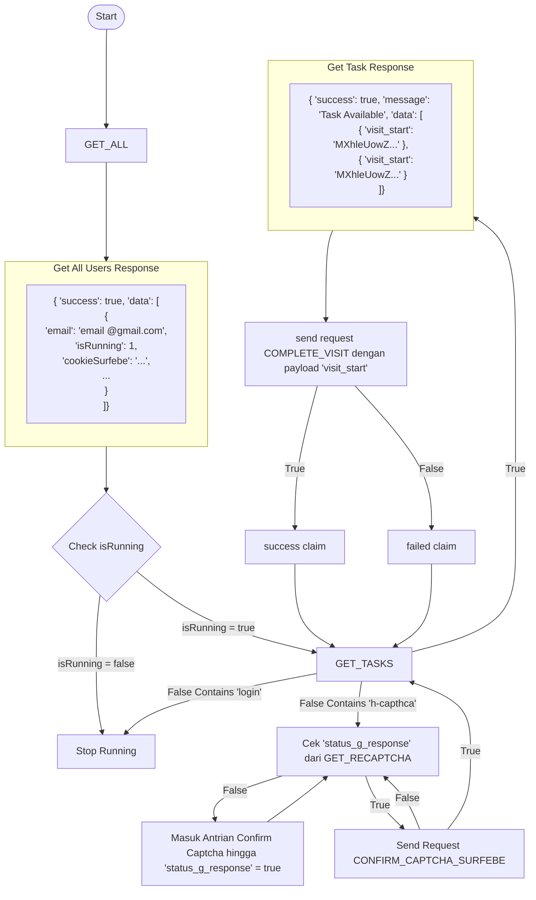

# Surfebe API Flow Documentation

## Flow Diagram



## API Endpoints

### 1. Get All Users
Request untuk mendapatkan semua data user.

```json
{
    "type": "USER",
    "action": "GET_ALL"
}
```

Response:
```json
{
    "success": true,
    "data": [
        {
            "id": 11,
            "email": "example@margodam.biz",
            "isRunning": 1,
            "cookieSurfebe": "PHPSESSID=...",
            // ... other user data
        }
    ]
}
```

### 2. Get Tasks
Request untuk mendapatkan task yang tersedia.

```json
{
    "type": "SURFEBE",
    "action": "GET_TASKS",
    "version": "182",
    "email": "example@gmail.com"
}
```

### 3. Complete Visit
Mengirim request untuk menyelesaikan task visit.

```json
{
    "type": "SURFEBE",
    "action": "COMPLETE_VISIT",
    "version": "182",
    "email": "example@gmail.com",
    "taskKey": "crgrtghrthrth=="
}
```

### 4. Confirm Captcha Surfebe
Verifikasi penyelesaian captcha.

```json
{
    "type": "SURFEBE",
    "action": "CONFIRM_CAPTCHA_SURFEBE",
    "email": "john@example.com"
}
```

### 5. Get Profile Surfebe
Mendapatkan informasi profil pengguna.

```json
{
    "type": "SURFEBE",
    "action": "PROFILE_SURFEBE",
    "email": "john@example.com"
}
```

### 6. Get Recaptcha
Request untuk mendapatkan challenge reCAPTCHA baru.

```json
{
    "type": "RECAPTCHA",
    "action": "GET_RECAPTCHA"
}
```

### 7. Get Token Recaptchas
Mendapatkan token reCAPTCHA.

```json
{
    "type": "RECAPTCHA",
    "action": "GET_TOKEN"
}
```

## Alur Proses

1. Proses dimulai dengan Get All Users (GET_ALL)
2. Setelah mendapat response GET_ALL:
   - Cek property isRunning untuk setiap user
   - Jika isRunning = true, lanjut ke Get Tasks
   - Jika isRunning = false, proses Stop Running
3. Jika Get Tasks response sukses dan ada task tersedia:
   - Akan mendapatkan data visit_start
   - Melakukan request COMPLETE_VISIT dengan payload visit_start
4. Jika response mengandung 'login':
   - Proses akan berhenti (Stop Running)
5. Jika response mengandung 'h-captcha':
   - Sistem akan mengecek status_g_response dari GET_RECAPTCHA
   - Jika false, masuk antrian Confirm Captcha
   - Jika true, mengirim request Confirm Captcha
6. Setelah claim visit:
   - Jika sukses, kembali ke Get Task
   - Jika gagal, kembali ke Get Task
7. Proses Captcha:
   - Masuk antrian hingga status_g_response = true
   - Setelah confirm captcha berhasil, kembali ke Get Task